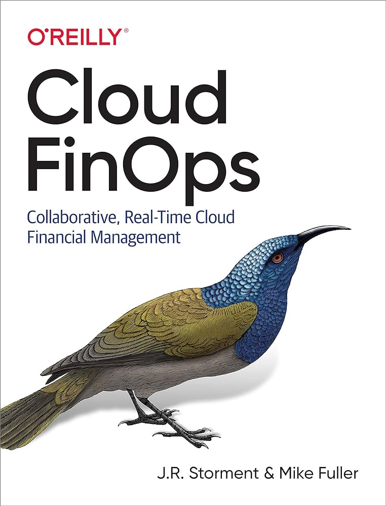
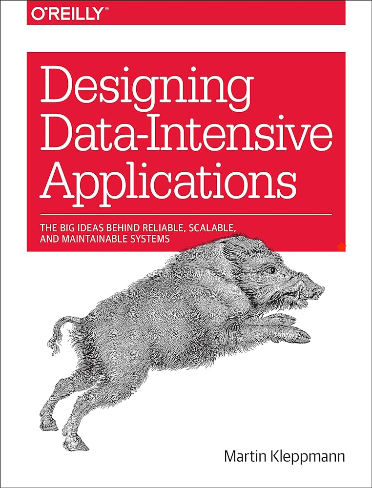
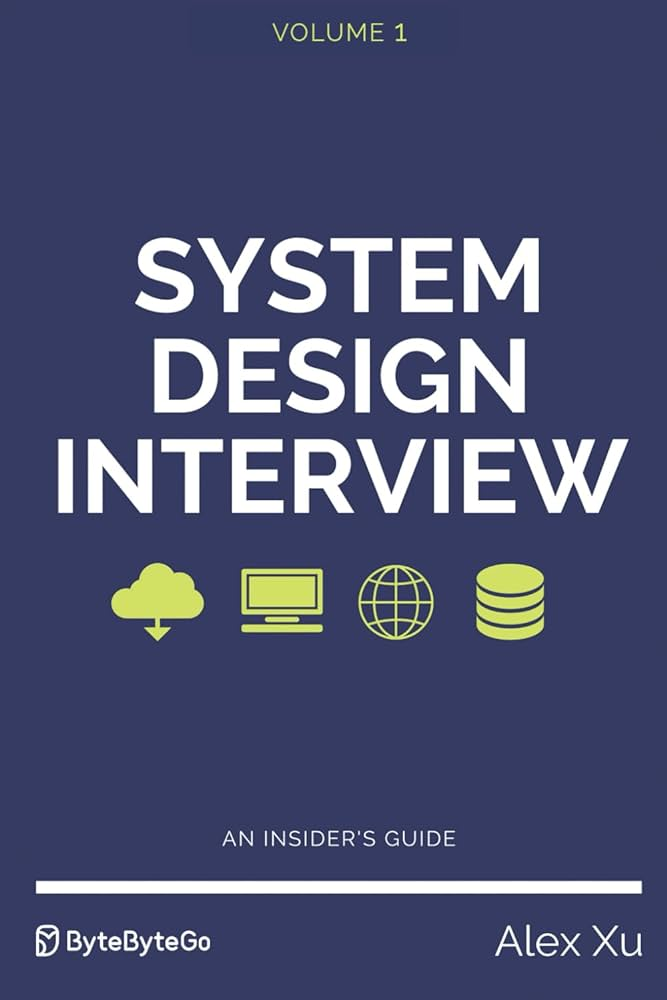
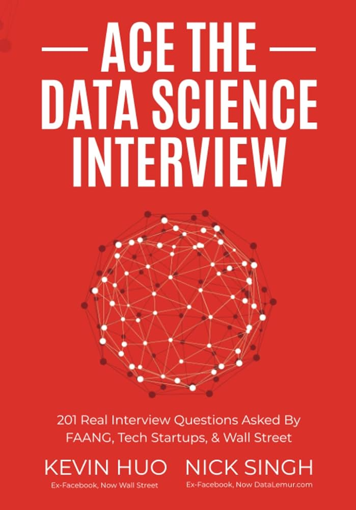

# Books

This directory contains a collection of books that I have read as part of my educational journey. Each book has its own folder where you can find notes, summaries, and thoughts on the book's content.

## List of Books

Here are the books I've read, along with their authors and links to their respective folders containing my notes and summaries.

### Cloud FinOps

Author: J.R. Storment & Mike Fuller

- **Folder**: [Cloud FinOps](./cloud-finops/)

### Designing Data-Intensive Applications

Author: Martin Kleppmann

- **Folder**: [Designing Data-Intensive Applications](./designing-data-intensive-applications/)

### System Design Interview - An Insider's Guide

Author: Alex Xu

- **Folder**: [System Design Interview - An Insider's Guide](./system-design-interview/)

### Ace the Data Science Interview

Authors: Nick Singh & Kevin Huo

- **Folder**: [Ace the Data Science Interview](./ace-the-data-science-interview/)

### The Data Warehouse Toolkit

Author: Ralph Kimball & Margy Ross

- **Folder**: [The Data Warehouse Toolkit](./the-data-warehouse-toolkit/)

---

Feel free to explore the folders for a deeper dive into what I've learned from each book!